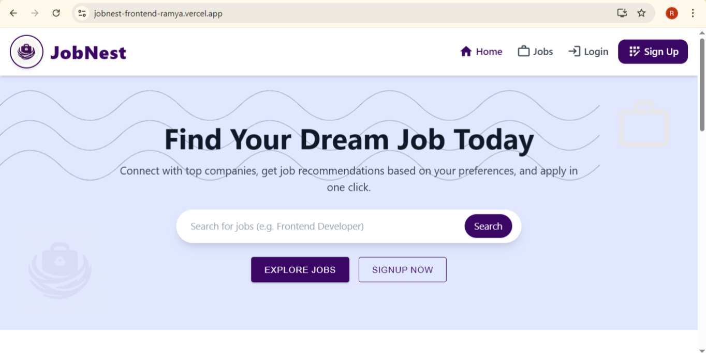
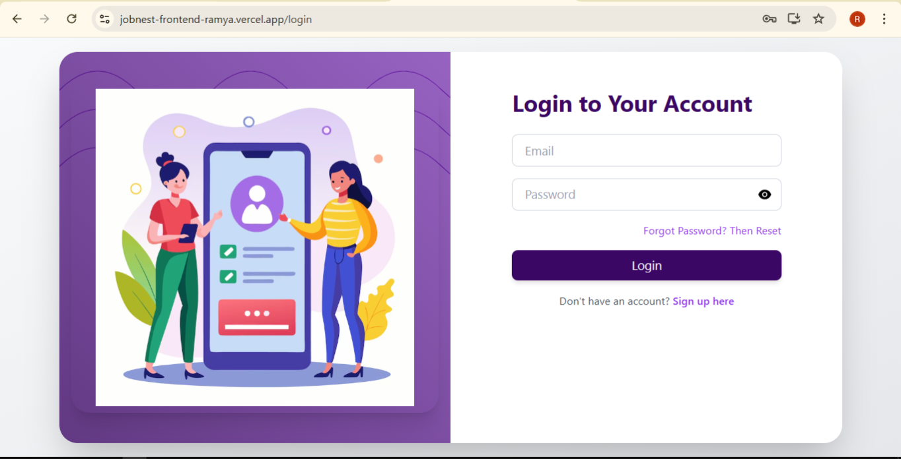
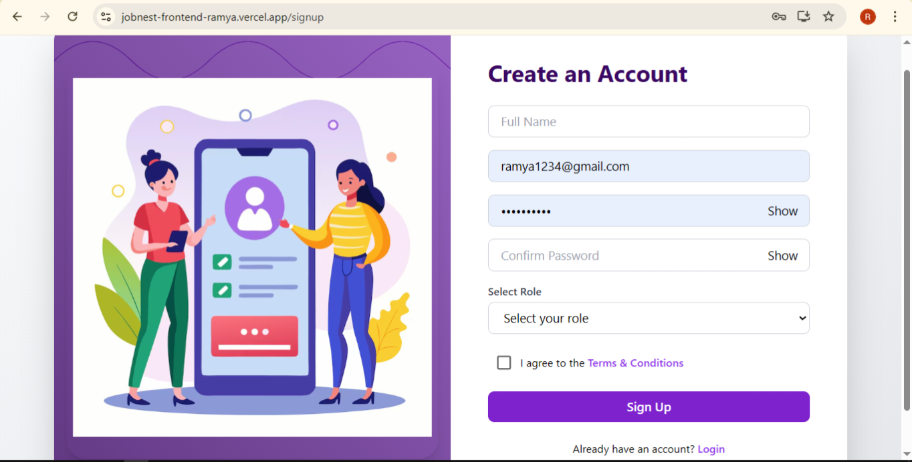
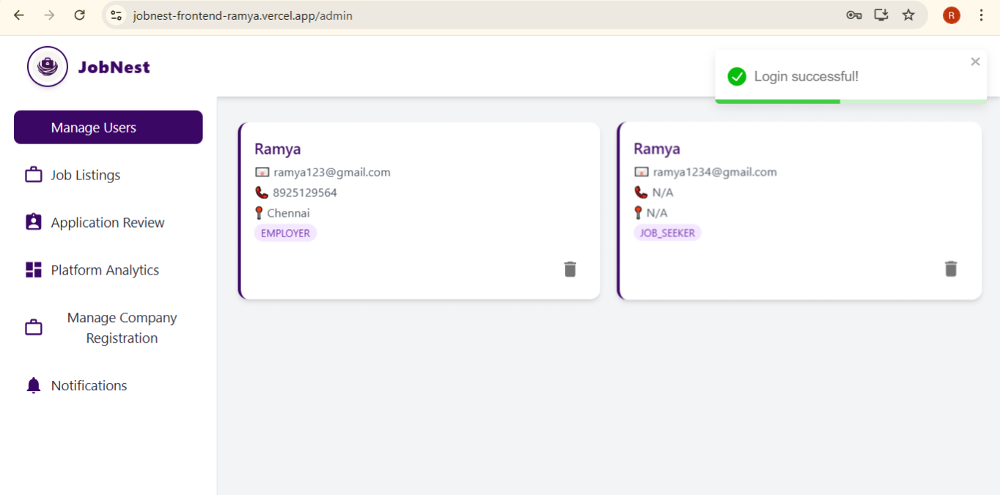
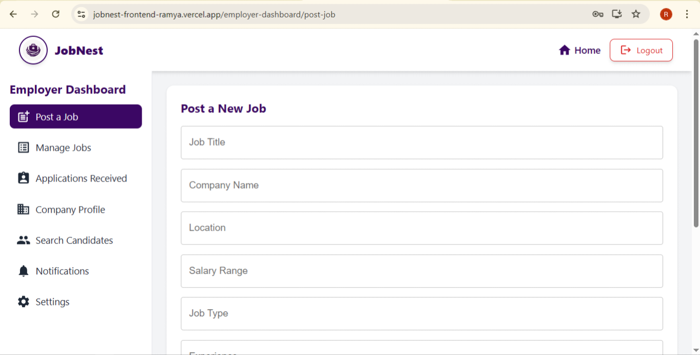
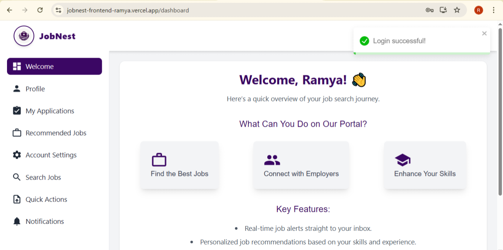

# 📌 Project Title – JobNest (Full-Stack Job Portal Application)

## 🔍 Overview
**JobNest** is a full-stack job portal designed to streamline hiring by connecting **Job Seekers**, **Employers**, and **Administrators** on a single platform. It features role-based dashboards, secure job and application management, and an intuitive user experience — making job hunting and recruiting smarter and simpler.

---

## 🚀 Tech Stack

- **Backend:** Java, Spring Boot (JPA, Security, Hibernate, REST API), MySQL
- **Frontend:** ReactJS, Tailwind CSS, Material UI, Framer Motion
- **DevOps & Deployment:** Docker, Render (Backend), Vercel (Frontend)
- **Version Control:** Git & GitHub

---

## 🌐 Live Demo

👉 [Explore JobNest Live!](https://jobnest-frontend-ramya.vercel.app/)

---

## 🛠 Core Features

- ✅ Role-based authentication (Job Seeker, Employer, Admin)
- ✅ Secure backend with Spring Security and RESTful APIs
- ✅ Job posting, editing, and deletion by employers
- ✅ Resume upload and application tracking for seekers
- ✅ Job search with filters (location, role, salary, experience)
- ✅ Admin dashboard for user and listing management
- ✅ Responsive, clean, and animated UI with React and Tailwind

---

## 🧠 Problem It Solves

JobNest eliminates fragmented and outdated job search experiences by providing:

- A centralized platform for seekers and recruiters
- Streamlined job application tracking
- Employer tools for job and candidate management
- Admin controls for platform integrity and governance

---

## 🌍 Impact

- 🚀 Accelerates hiring by enabling direct employer-candidate communication
- 🧩 Reduces spam with role-based access control and admin oversight
- 🔄 Enhances user engagement with polished dashboards and real-time features

---
## 📸 Screenshots

### 🏠 Home Page


### 🔐 Login Page


### 📝 SignUp Page


### 🛠 Admin Dashboard


### 🏢 Employer Dashboard


### 👨‍💼 Job Seeker Dashboard


## 🔧 Installation & Local Setup

### 📁 Clone the Repositories

```bash
# Frontend repo
git clone https://github.com/ramya-0315/jobnest-frontend.git

# Backend repo
git clone https://github.com/ramya-0315/jobnest-backend.git
